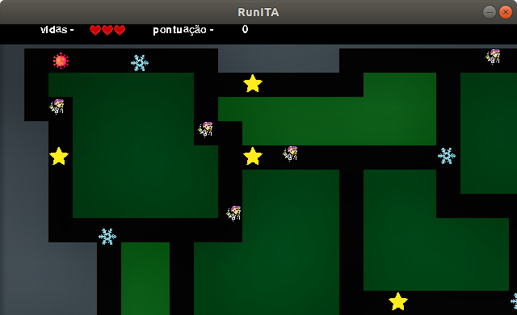

# RunITA

Jogo desenvolvido para a disciplina de CES-22 do ITA. 

Equipe: Ana Paula Lopes Schuch, Lucas Gameiro Borges e Vinícius de Pádua Dias Araújo.

#### Objetivos do Jogo:
Passar de fase, capturando o maior número de elementos do cenário, sem ser atingido por inimigos.

####Instruções:
O jogador deverá utilizar as teclas cima, baixo, direita e esquerda para se mover. 
Para passar de fase, o jogador deverá encontrar o portal, designado pela imagem:
 

Além disso, há dois tipos de inimigos: os que andam aleatoriamente e os que perseguem o personagem.
Não é possível saber qual dos dois tipos o inimigo é, então tome cuidado!

O personagem poderá capturar as estrelas do cenário, e assim aumentar sua velocidade por um determinado período.

Ao ser capturado mais do que quatro vezes, o jogo é encerrado e há a opção para recomeçar.

O cenário é revelado a cada movimento do personagem, de modo que não é possível enxergar todos os inimigos.
